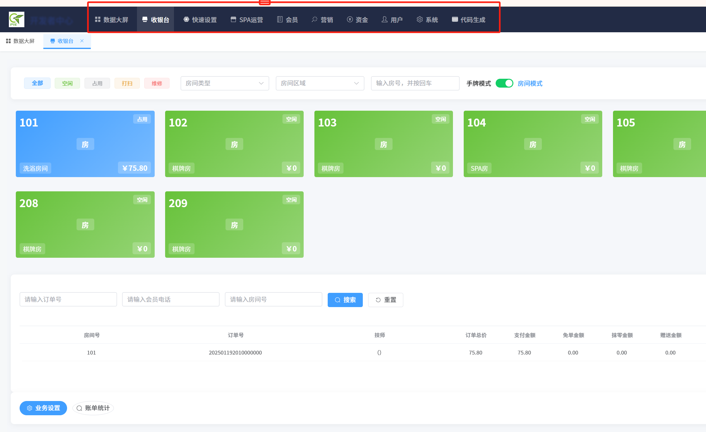
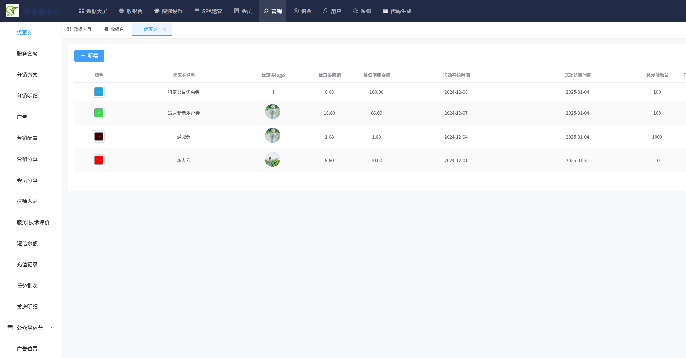
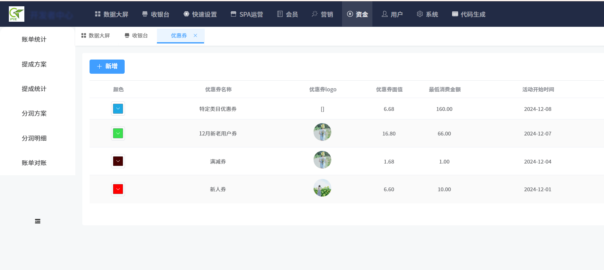
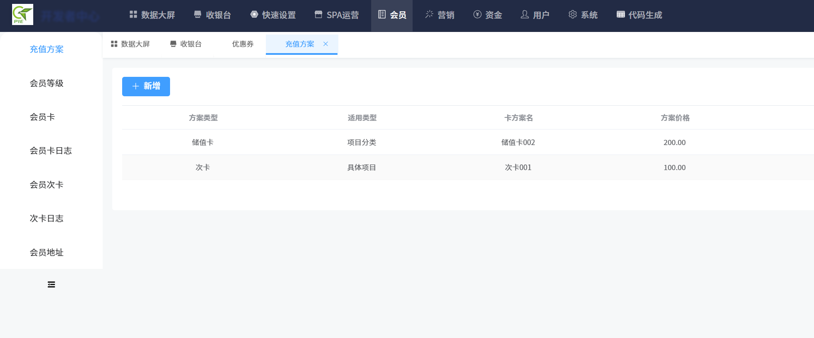
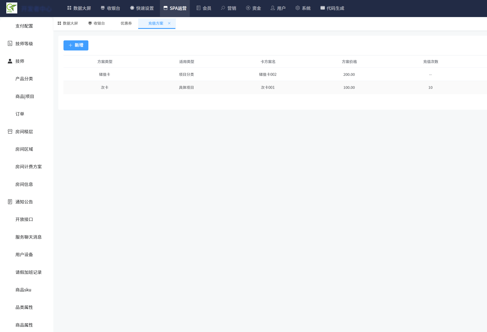
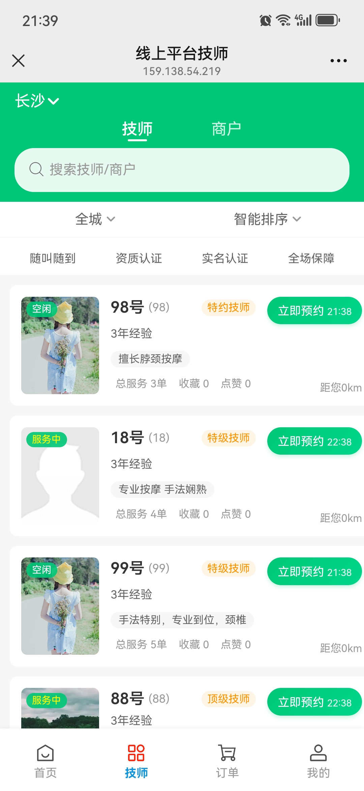
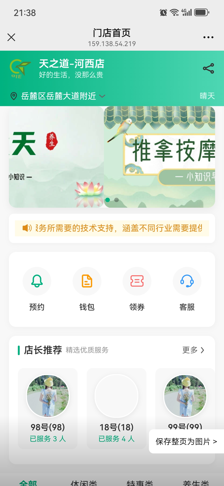
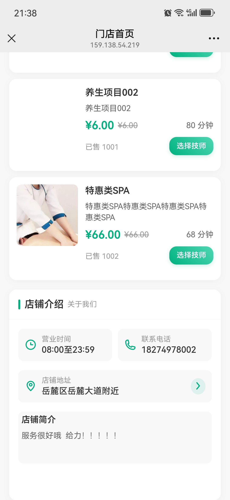
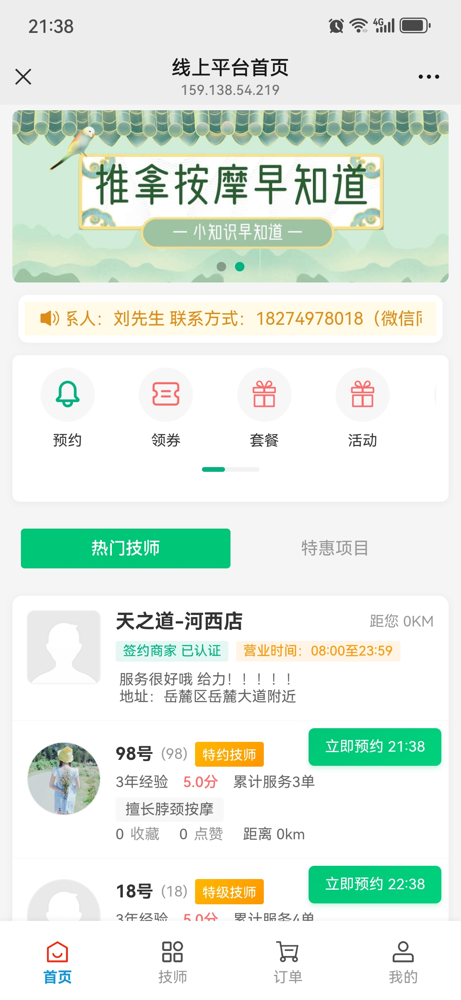

# 最新体验地址&账号
## 管理端 http://159.138.54.219:2888/admin/ 【18274978002  123456】  请不用纠结到家和到店的问题！！
## 用户端 http://159.138.54.219:2888/app/   客户体验手机号： 18274978100   技师手机号：18274978004
#### 输入手机号+验证码登录 短信验证码是弹出来的！！弹出来的！！

# 更新记录【2025.09.28】
## 补充集团-连锁-运营门店 逻辑和数据查询关系 优化数据结果关系
## 优化移动端 优化支付多种方式选择【微信支付、储值卡支付、计次卡支付、积分兑换】
## 优化优惠券、储值卡、计次卡、套餐等
## 管理端优化、储值卡、计次卡充值方案、消费逻辑配置等
## 依赖优化、单号生成统一优化、部分技术升级改造、打包依赖精简 依赖的外部大文件 剥离出打包
## **** 重点：管理端前段使用electron打包EXE，这样更方便客户的使用、同时为管理运营模式更好的扩展打好基础：可单独买断【客户本地化部署】、可saas化等，下一步会将服务端打包成EXE以此来支持这种模式的运营（linux服务器可以了，正在解决windows本地原生）【请联系我获取 下次补充个下载地址】
## 现阶段个人感觉可以作为一个多租户、多业务模式的脚手架了！！

# 更新记录【2025.05.22】
## 1、整体体验升级，区分用户、技师、管理、代理商（分销）几个手机端；
## 2、管理端优化，增强到店、上门的区分度和逻辑调整，可满足上门、到店、有门店可上门场景及结合；

# 更新记录【2025.05.16】
## 1、管理端的基本运营功能移动端实现：维护技师、项目、优惠券、提成方案、会员卡等；
## 2、管理端优化、会员卡积分转余额等；
## 3、H5端用户、技师、运营、代理商角色登录后进入不同的操作优化，补充技师入驻和审核等；

# 更新记录【2025.04.26】
## 1、优化管理端菜单、优化用户端界面样式和部分操作，主要集中在用户选择项目、技师围绕整个下单过程的操作优化等；
## 2、新增客户及咨询者提出的需求点如：分润分佣、提成、次卡等功能
## 3、后端补充MQTT、优化部分测试bug等
## 下一步计划：优化技师手机端、优化经营者手机端、继续完成到店的逻辑，做到线上线下的完美结合！

# - 服务到家，绿色便捷
服务到家非常适合用于:上门按摩、美妆到家、私教上门等不同行业的上门业务，帮助您轻松开展对外业务、开拓新的业务领域，将富余的资源对外释放，增加收益、加速业务增长发展。

#### ** 购买源码支持提需求，技术实现免费，永久支持此项！！！
说明：无论哪种合作方式，支持付费后为其定制，根据开发者时间合理安排！！！

## 功能结构&业务架构

| 功能                         | 描述           |
|----------------------------|----------------|
| 1、系统模块                     |                |
| 2、用户模块                     |                |
| 3、门店新增                     |                |
| 4、分佣设置、明细等                 |                |
| 5、订单管理                     |                |
| 6、项目管理                     |                |
| 7、会员充值、会员次卡、会员等级、积分、优惠券、套餐 |                |
| 8、每日资金账单、每日分佣结算【商户】、提成&&         |                |
| 9、房间管理、手牌                  |                |
| 10、收银台                     |                |
| 11、代理技师入驻、订单分佣                 |                |
| 12、公众号运营 已设计，待开发           |                |
| 13、智能接入 已设计，待开发            |                |

### 项目优势
1、减少从0到1的设计、研发成本，降低企业上门服务的门槛，提升企业的服务能力。
2、多年足浴行业经验积累，服务到家平台可以提供足浴洗浴行业的服务，帮助企业快速实现足浴行业的开拓。
3、同时考虑支持多行业的上门服务，满足不同行业的需求。
4、平台模式，支持多门店、多租户模式，支持店内业务支持的预留。
5、无保留的技术支持，提供免费的技术支持和说明。
6、承接定制开发，根据企业需求提供定制开发服务。
7、技术栈丰富：springboot3、jdk17+、MySQL8、redis、uniapp、vue+ele、基础的代码生成器包含前端（前端代码组件化非常简洁明了，可以快速实现功能）
没有自己造轮子，完全采用开源技术，保证了项目的100%透明性，部分技术说明如下：redisson、sa-token、lock4j、hutool、sms4j、x-file-storage、wx-java、IJPay等等，
如有微服务需求，可免费提供支持转型微服务。

从业务架构和技术架构设计上满足支持不同行业中需要上门服务的场景，同时支持以平台方式运营，支持多门店、多租户模式，设计上保留店内业务支持的预留，类似于足浴洗浴行业到店业务等等。
** 特别说明 支持以平台方式或单门店自由切换 **
### 使用场景

**服务到家**非常适合用于**上门按摩、美妆到家、私教上门等不同行业的上门业务**，帮助您轻松开展**对外业务，将富余的资源对外释放，增加收益、加速业务增长发展**。

### 联系方式
刘先生 18274978018(微信同号)

### 合作方式
源码购买、可运行包提需求更新上线持续使用、定制等等其他可详细聊聊，欢迎沟通了解相互学习共同进步。

### 体验地址
运营端：http://159.138.54.219:2888/admin 18274978002/123456
用户端：http://159.138.54.219:2888/app  管理手机号（18274978002）、技师手机号登录（18274978005）、普通用户请用自己的手机号登录即可；点击登陆会弹出验证码  

### 下一步计划
1、套餐下单包括PC及用户端  
2、内容分享、传播【积分、活动、优惠券】  
3、功能优化完善  
4、出统计报表  
5、分销、分佣功能合理化、完善  
说明：【C端管理端是未来想要做的大概原型和想法、技师端待优化完善、普通用户端后续功能会继续优化】

### 免责申明
承诺此项目提供健康便捷的上门服务，如有非法经营者涉嫌违法违纪，概不负责。使用本软件的风险由用户自行承担，开发者不对任何因使用本软件而产生的损失负责。
使用此项目相关人员，请遵纪守法，尊重他人劳动成果，切勿传播违法信息。
